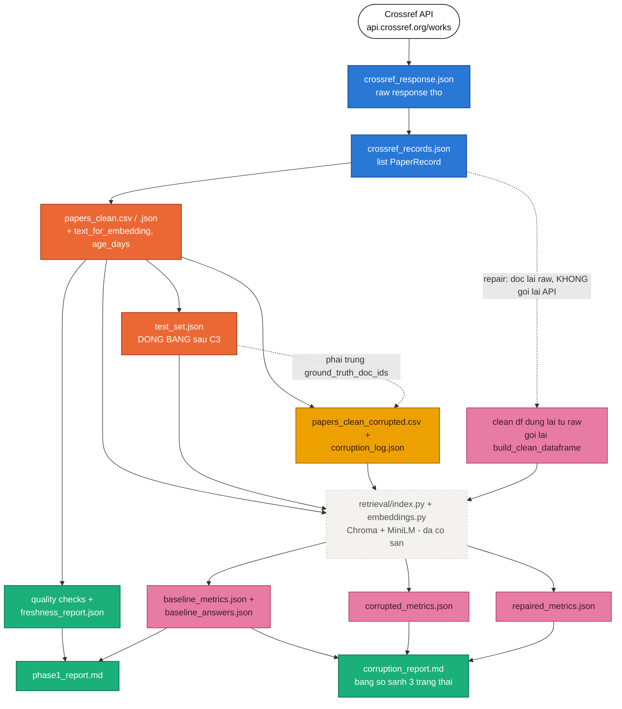
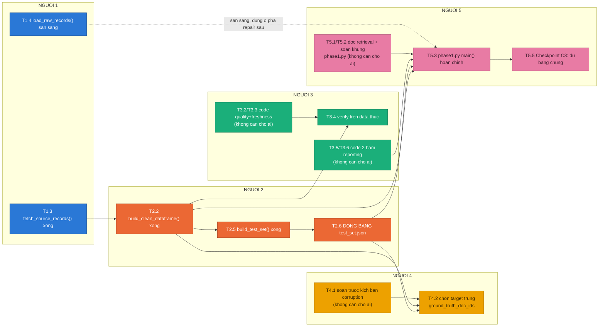
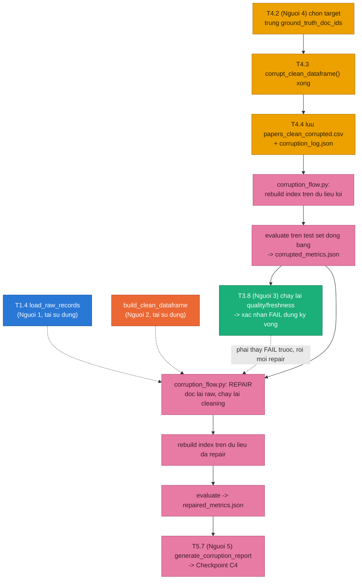

# Phân công 5 vai trò — Lab 10: Data Pipeline & Data Observability

> Bám theo file thật trong `src/` (repo hiện tại) · zero-conflict theo quyền sở hữu file · mốc thời gian 210 phút.
> Đây là bản `.md` (đọc trực tiếp trong VS Code, không cần trình duyệt) của bản đầy đủ có sơ đồ tại:
> https://claude.ai/code/artifact/ba1fc73e-ce87-4fa4-9217-a85310e18768

Bảng phân công dưới đây soi trực tiếp vào `src/` của repo hiện tại (12 hàm `TODO(student)` trong 8 file) — chỉ rõ **đúng dòng code**, **đúng file**, **đúng thứ tự chờ nhau** cho 5 người. Nguyên tắc chia: **mỗi file có đúng một người sửa**, nên về code sẽ không ai đụng file của ai.

**Chú giải người phụ trách:** Người 1 · Source — Người 2 · Cleaning & Eval-set — Người 3 · Observability — Người 4 · Corruption — Người 5 · Integration — Cả nhóm / Checkpoint.

## 6 quy tắc vàng — thoả thuận trước khi tách nhau ra code

1. **Một file, một người sửa.** Bảng ở mục 6 liệt kê chính xác ai giữ file nào — không ai khác commit vào file đó.
2. **Không đổi contract giữa buổi.** Tên cột clean schema, tên field `PaperRecord`, tên field test set, tên key metrics — thống nhất ở phút 00:20 và giữ nguyên tới hết buổi.
3. **`paper_id` là khoá xuyên suốt.** Mọi module tra cứu tài liệu qua field này, không tra theo title.
4. **Test set đóng băng ngay sau Checkpoint C3.** Sau khi baseline chạy ra `baseline_metrics.json` lần đầu, không ai sửa `data/eval/test_set.json` nữa.
5. **Corruption phải trúng `ground_truth_doc_ids`.** Nếu Người 4 làm hỏng những `paper_id` không nằm trong test set, metrics sẽ không đổi — vô nghĩa.
6. **Repair đọc lại từ raw snapshot, không gọi lại API.** Và không ai sửa `src/core/config.py`, `src/retrieval/*.py`, `src/evaluation/metrics.py` — 3 nhóm file này đã hoàn chỉnh sẵn (reference code), trừ khi phát hiện bug thật và báo cả nhóm trước khi sửa.

---

## 1. Kiến trúc dữ liệu & quyền sở hữu file

Mỗi khối màu = một người sở hữu file đó. Khối viền nét đứt là **code tham khảo có sẵn** (không ai cần sửa, chỉ gọi lại).



Lưu ý: khối `retrieval/index.py + embeddings.py` xuất hiện 3 lần vì cùng một đoạn code tham khảo được gọi lại 3 lần (baseline / corrupted / repaired) với 3 collection Chroma khác nhau — không phải 3 file khác nhau.

---

## 2. Ai chờ ai — phụ thuộc theo từng task

Mỗi khối là một mã task (khớp với bảng chi tiết ở mục 4), mũi tên = **phải xong cái trước mới làm được cái sau**. Nét đứt = phụ thuộc "mềm", nét liền = phụ thuộc "cứng".

### 2a. Pha xây khối cơ bản (00:40–01:45) — chạy song song, hội tụ về Người 5



Đọc nhanh: Người 5 có 3 mũi tên cứng đổ vào `T5.3` — Người 5 **không thể chạy xong** `phase1.py` nếu bất kỳ ai trong Người 1/2/3 chưa xong. Ngược lại T4.1, T3.2/T3.3, T5.1/T5.2 không có mũi tên vào — làm được ngay từ phút 0, không cần chờ.

### 2b. Pha corruption & repair (02:25–03:10) — chuỗi tiếp sức qua tay 4 người



Đọc nhanh: đây gần như một đường thẳng — mỗi người chỉ giữ pipeline trong đúng đoạn của mình rồi bàn giao tiếp. **Không có việc nào của pha này chạy được trước khi Checkpoint C3 (baseline) hoàn tất.**

---

## 3. Lịch trình 210 phút theo từng người

```mermaid
gantt
    title Lich trinh 210 phut - Lab 10 Data Pipeline and Observability
    dateFormat HH:mm
    axisFormat %H:%M
    todayMarker off

    section CA NHOM - CHECKPOINT
    C0 Setup + TODO list xong                    :milestone, m0, 00:20, 0m
    C1 Contract + phan vai chot                   :milestone, m1, 00:40, 0m
    C2 Clean data + test set dong bang             :milestone, m2, 01:45, 0m
    C3 Baseline evidence day du                    :milestone, m3, 02:25, 0m
    C4 Corrupted + repaired evidence day du         :milestone, m4, 03:10, 0m
    C5 Dong goi & nop bao cao                       :milestone, m5, 03:30, 0m

    section NGUOI 1 - Source
    Setup env, doc contract PaperRecord            :00:00, 20m
    Dong y contract ca nhom (muc 1 group_report)   :00:20, 20m
    Code 3 ham crossref.py, verify raw, ban giao N2 :00:40, 65m
    Ho tro debug ingestion khi chay baseline        :01:45, 40m
    San sang load_raw_records cho buoc repair       :02:25, 45m
    Viet report ca nhan + gop muc 5                 :03:10, 20m

    section NGUOI 2 - Cleaning and Eval-set
    Setup env, doc clean schema + eval schema       :00:00, 20m
    Dong y contract ca nhom (muc 1 group_report)    :00:20, 20m
    Code build_clean_dataframe roi build_test_set   :00:40, 65m
    Ho tro debug cleaning/testset khi chay baseline :01:45, 40m
    San sang: build_clean_dataframe tai dung cho repair :02:25, 45m
    Viet report ca nhan + gop muc 5 va 6            :03:10, 20m

    section NGUOI 3 - Observability
    Setup env, doc contract quality + report        :00:00, 20m
    Dong y contract ca nhom (muc 1 group_report)    :00:20, 20m
    Code quality.py va reporting.py (chua can cho ai) :00:40, 65m
    Verify quality/freshness PASS tren data baseline :01:45, 40m
    Chay lai quality/freshness tren data loi, xac nhan FAIL :02:25, 45m
    Viet report ca nhan + gop muc 8                  :03:10, 20m

    section NGUOI 4 - Corruption
    Setup env, doc 4 kich ban corruption goi y       :00:00, 20m
    Dong y contract ca nhom (muc 1 group_report)     :00:20, 20m
    Soan truoc kich ban, cho clean data cua Nguoi 2  :00:40, 65m
    Doi chieu ground_truth_doc_ids voi test_set.json :01:45, 40m
    Code + chay corrupt_clean_dataframe, ghi log     :02:25, 45m
    Viet report ca nhan + gop muc 9                  :03:10, 20m

    section NGUOI 5 - Integration
    Setup env, doc thu tu goi ham retrieval/eval     :00:00, 20m
    Dong y contract ca nhom (muc 1 group_report)     :00:20, 20m
    Doc retrieval/*, soan khung phase1.py (chua can cho ai) :00:40, 65m
    Chay + debug phase1.py, dat Checkpoint C3        :01:45, 40m
    Chay + debug corruption_flow.py, dat Checkpoint C4 :02:25, 45m
    Tong hop metrics thuc vao group_report, kiem tra DoD + git :03:10, 20m
```

Hàng "(chưa cần chờ ai)" là việc làm được ngay dù chưa có input — xếp vào lúc rảnh để không ai ngồi không, đặc biệt là Người 5 vốn bị chặn nhiều nhất ở khối xây dựng.

---
## 4. Nhiệm vụ theo từng vai trò

### 👤 Người 1 — Source Ingestion Owner

- **File sở hữu:** `src/ingestion/crossref.py`
- **Mục tiêu:** Lấy dữ liệu thật từ Crossref, lưu đủ 2 dạng raw artifact, cho phép nạp lại mà không cần gọi lại API.
- **Chờ ai để bắt đầu:** Không ai — bắt đầu ngay phút 0. Chỉ cần mạng, **không** cần LLM API key.
- **Ai đang chờ mình:** Người 2 (T2.2 cần raw records) · Người 5 (T5.3 và bước Repair trong T5.6)

| Mã | Việc cần làm | File : dòng | Chờ (input từ) | Output / Artifact | Ai chờ tiếp |
|---|---|---|---|---|---|
| T1.1 | Đọc & thống nhất field bắt buộc non-null của `PaperRecord` với Người 2 (contract đầu ra module này = contract đầu vào module Người 2). | crossref.py:9-21 | — (đồng bộ ở phút 20) | Thống nhất ghi vào mục 1 group_report.md | Người 2 |
| T1.2 | Implement `parse_crossref_payload(payload) -> list[PaperRecord]`: duyệt `payload["message"]["items"]`, lấy DOI/title/abstract/authors/subject/date/URL, chuẩn hoá text, bỏ record thiếu title/abstract. | crossref.py:24-33 | T1.1 | Hàm dùng nội bộ bởi T1.3 | Chính mình |
| T1.3 | Implement `fetch_source_records(settings) -> list[PaperRecord]`: build params từ `source_query/source_filter/max_results`, gọi `api.crossref.org/works`, retry/backoff HTTP 429/503, lưu response thô, gọi `parse_crossref_payload`, lưu records. | crossref.py:36-46 | T1.2 | `data/raw/crossref_response.json`, `data/raw/crossref_records.json` | Người 2, Người 5 |
| T1.4 | Implement `load_raw_records(path) -> list[PaperRecord]`: đọc lại JSON snapshot có sẵn — dùng khi `REFRESH_SOURCE=false`, và **bắt buộc** dùng lại ở bước Repair (không gọi API lần 2). | crossref.py:49-51 | T1.2 | Hàm sẵn sàng cho `corruption_flow.py` | Người 5 (bước Repair) |
| T1.5 | Test thủ công: chạy `fetch_source_records` với `Settings` thật, xác nhận 2 file JSON xuất hiện và đủ record hợp lệ. | — | T1.3 | Xác nhận artifact hợp lệ | Cả nhóm (C0/C2) |
| T1.6 | Báo cho Người 2 ngay khi `crossref_records.json` ổn định (schema `PaperRecord` không đổi nữa trong buổi). | — | T1.5 | Tín hiệu "raw sẵn sàng" | Người 2 |
| T1.7 | Viết `report/individual_[MSSV].md` phần vai trò; trả lời TODO nào cần API key, phần nào test không cần key. | report/individual_*.md | T1.3, T1.4 | Báo cáo cá nhân | Cả nhóm (C5) |

> **✅ Trạng thái hiện tại (đã cập nhật):** T1.1–T1.4 đã có code thật trong `crossref.py` (parse Crossref JSON đúng schema `PaperRecord`, retry 429/503 exponential backoff, lưu 2 file raw, load lại từ snapshot). Còn lại T1.5 (chạy thật để tạo `data/raw/*.json`), T1.6 (báo Người 2), T1.7 (report cá nhân).

---

### 👤 Người 2 — Cleaning & Evaluation-Set Owner

- **File sở hữu:** `src/ingestion/cleaning.py`, `src/evaluation/testset.py`
- **Mục tiêu:** Biến raw records thành DataFrame sạch đúng contract; đóng băng bộ câu hỏi đánh giá dùng chung cho cả 3 trạng thái.
- **Chờ ai để bắt đầu:** Người 1 (T1.3/T1.6 — cần `crossref_records.json`)
- **Ai đang chờ mình:** Người 3, Người 4, Người 5 — **đây là người bị chờ nhiều nhất** trong pha xây khối cơ bản

| Mã | Việc cần làm | File : dòng | Chờ (input từ) | Output / Artifact | Ai chờ tiếp |
|---|---|---|---|---|---|
| T2.1 | Đọc contract đầu vào (`PaperRecord`) và contract đầu ra mà `retrieval/index.py::_build_documents` (có sẵn) đòi hỏi: cột `paper_id, title, text_for_embedding, published, authors_joined, categories_joined, summary, abs_url, pdf_url`. | index.py:44-66 (chỉ đọc) | T1.1 | Danh sách cột bắt buộc | Chính mình |
| T2.2 | Implement `build_clean_dataframe(records, run_date)`: drop record thiếu title/summary <100 ký tự, strip tag XML/HTML, join authors→`authors_joined`, categories→`categories_joined`, parse ngày→`YYYY-MM-DD`, tính `age_days` & `summary_chars`, tạo `text_for_embedding`, drop duplicate theo `paper_id`, sort, return. | cleaning.py:10-25 | T1.3 | DataFrame trong bộ nhớ | Chính mình |
| T2.3 | Lưu ra `data/clean/papers_clean.csv` + `.json`; tự kiểm `paper_id` unique/non-null trước khi báo xong. | gọi từ phase1.py | T2.2 | `data/clean/papers_clean.csv` / `.json` | Người 3, 4, 5 |
| T2.4 | Báo Người 3 / Người 4 / Người 5 ngay khi clean data ổn định — artifact chặn đường nhiều người nhất trong buổi. | — | T2.3 | Tín hiệu "clean data sẵn sàng" | Người 3, 4, 5 |
| T2.5 | Implement `build_test_set(df, output_path)`: chọn record đại diện, sinh câu hỏi 4 loại (summary/authors/date/categories) với field đúng `id/question_type/question/ground_truth/ground_truth_doc_ids`. | testset.py:8-27 | T2.3 | `data/eval/test_set.json` | Người 4, Người 5 |
| T2.6 | **Đóng băng:** ngay sau khi Người 5 chạy baseline ra `baseline_metrics.json` lần đầu (Checkpoint C3), KHÔNG sửa `test_set.json` nữa. | data/eval/test_set.json | T5.5 | Cam kết "đã đóng băng" | Người 4 (bắt buộc) |
| T2.7 | Gửi danh sách đầy đủ `ground_truth_doc_ids` cho Người 4 — Người 4 buộc phải corrupt trúng các `paper_id` này. | data/eval/test_set.json | T2.6 | Danh sách `paper_id` mục tiêu | Người 4 |
| T2.8 | Viết report cá nhân phần "Cleaning & data modeling" + "Evaluation set"; điền bảng schema mục 5-6 group_report.md. | report/individual_*.md | T2.3, T2.5 | Báo cáo cá nhân | Cả nhóm (C5) |

---
### 👤 Người 3 — Data Observability Owner

- **File sở hữu:** `src/observability/quality.py`, `src/observability/reporting.py`
- **Mục tiêu:** Phát hiện lỗi dữ liệu bằng số liệu khách quan và viết báo cáo markdown cho cả 2 pha.
- **Chờ ai để bắt đầu:** Không ai để **code** (viết được ngay với DataFrame mẫu) — chỉ cần Người 2 để **verify** trên data thật.
- **Ai đang chờ mình:** Người 5 (cần cả 2 hàm reporting cho cả 2 pipeline) · Người 4 (cần biết quality FAIL đúng kỳ vọng)

| Mã | Việc cần làm | File : dòng | Chờ (input từ) | Output / Artifact | Ai chờ tiếp |
|---|---|---|---|---|---|
| T3.1 | Code sớm 2 hàm trong `quality.py` bằng DataFrame mẫu tự tạo — **không cần chờ Người 2** vì logic chỉ cần đúng shape cột. | quality.py | Không cần chờ | Code khung sẵn | Chính mình |
| T3.2 | Implement `run_data_quality_checks(df, settings, report_name)`: check row count > 0, `paper_id` non-null & unique, `title` non-null, độ dài `summary`, freshness qua `age_days`; ghi PASS/FAIL từng rule. | quality.py:10-21 | T3.1 | `data/quality/{report_name}.json` | Người 5 |
| T3.3 | Implement `build_freshness_report(df, settings, report_path)`: tìm `latest_published`/`oldest_published`, đếm `stale_rows` (ngưỡng `freshness_threshold_days=180`), payload gồm `latest_published, oldest_published, stale_rows, total_rows, is_fresh`. | quality.py:24-38 | T3.1 | `data/quality/freshness_report.json` | Người 5 |
| T3.4 | Verify thật: khi Người 2 báo clean data sẵn sàng, chạy 2 hàm trên với data thật, xác nhận toàn bộ rule PASS ở baseline. | — | T2.4 | Xác nhận PASS trên data thật | Người 5 (C3) |
| T3.5 | Implement `generate_phase1_report(report_path, source_summary, metrics, quality, freshness)`: gom source summary, in metrics retrieval/evaluation, in quality + freshness, ghi markdown. | reporting.py:6-21 | T3.1 | Hàm sẵn sàng cho phase1.py | Người 5 |
| T3.6 | Implement `generate_corruption_report(...)` (7 tham số): bảng markdown so sánh 3 cột Baseline–Corrupted–Repaired. | reporting.py:24-35 | T3.1 | Hàm sẵn sàng cho corruption_flow.py | Người 5 |
| T3.7 | Bàn giao 2 hàm reporting.py cho Người 5 **trước** khi Người 5 cần chạy 2 pipeline. | — | T3.5, T3.6 | Tín hiệu "reporting sẵn sàng" | Người 5 |
| T3.8 | Ở pha corruption: chạy lại 2 hàm quality/freshness trên data lỗi của Người 4, xác nhận FAIL đúng kỳ vọng — vai trò kiểm định độc lập. | — | T4.4 | Bằng chứng FAIL ghi nhận đúng | Người 5, Người 4 |
| T3.9 | Viết report cá nhân phần "Data observability"; điền bảng quality/freshness mục 8 group_report.md. | report/individual_*.md | T3.4, T3.8 | Báo cáo cá nhân | Cả nhóm (C5) |

---

### 👤 Người 4 — Corruption & Repair-Validation Owner

- **File sở hữu:** `src/ingestion/corruption.py`
- **Mục tiêu:** Làm hỏng dữ liệu có kiểm soát, trúng đúng tài liệu nằm trong test set, để metrics thực sự thay đổi và đo được.
- **Chờ ai để bắt đầu:** Người 2 (clean data T2.3 + test set đã đóng băng T2.6/T2.7)
- **Ai đang chờ mình:** Người 5 (corruption_flow.py cần data lỗi + log) · Người 3 (verify vòng 2)

| Mã | Việc cần làm | File : dòng | Chờ (input từ) | Output / Artifact | Ai chờ tiếp |
|---|---|---|---|---|---|
| T4.1 | Trong lúc chờ: đọc trước 4 kịch bản gợi ý (blank summary, stale date, duplicate, noise), soạn kế hoạch chọn ≥3 kịch bản + lý do. | Guide.md (đọc) | Không cần chờ | Bảng kế hoạch corruption | Chính mình |
| T4.2 | Khi có clean data **và** test set đã đóng băng: đối chiếu `ground_truth_doc_ids` để chọn đúng `paper_id` sẽ corrupt — **bắt buộc overlap**. | — | T2.3, T2.6, T2.7 | Danh sách `paper_id` mục tiêu | Chính mình |
| T4.3 | Implement `corrupt_clean_dataframe(df, output_log_path)`: áp dụng ≥3 kịch bản đã chọn đúng vào `paper_id` mục tiêu, rebuild `text_for_embedding`. | corruption.py:6-19 | T4.2 | DataFrame lỗi trong bộ nhớ | Chính mình |
| T4.4 | Lưu `data/clean/papers_clean_corrupted.csv` (+ `.json`) và ghi log chi tiết vào `data/results/corruption_log.json`. | gọi từ corruption_flow.py | T4.3 | `papers_clean_corrupted.csv`, `corruption_log.json` | Người 5, Người 3 |
| T4.5 | Phối hợp với Người 3: nhờ chạy quality/freshness check trên data lỗi để xác nhận FAIL đúng kỳ vọng. | — | T4.4 | Yêu cầu verify gửi Người 3 | Người 3 |
| T4.6 | Bàn giao `papers_clean_corrupted.csv` + `corruption_log.json` cho Người 5. | — | T4.4 | Tín hiệu "corrupted data sẵn sàng" | Người 5 |
| T4.7 | Sau khi có `corrupted_metrics.json`: đối chiếu hit-rate/F1 có giảm ở đúng câu hỏi liên quan `paper_id` đã corrupt. | data/results/corrupted_metrics.json | Người 5 (T5.6) | Xác nhận corruption "thấy được" | Người 5 (nếu cần sửa) |
| T4.8 | Viết report cá nhân phần "Corruption scenarios"; trả lời "kịch bản nào ảnh hưởng retrieval nặng nhất". | report/individual_*.md | T4.4, T4.7 | Báo cáo cá nhân | Cả nhóm (C5) |

---

### 👤 Người 5 — Pipeline Integration & Evidence Owner

- **File sở hữu:** `src/pipelines/phase1.py`, `src/pipelines/corruption_flow.py`
- **Mục tiêu:** Lắp ráp toàn bộ mảnh ghép của 4 người thành 2 pipeline chạy được thật, sinh bằng chứng số liệu cuối cùng.
- **Chờ ai để bắt đầu:** Tất cả 4 người — nút thắt cuối chuỗi của cả 2 pipeline. Có prep-work để không ngồi không (T5.1, T5.2).
- **Ai đang chờ mình:** Cả nhóm chờ metrics cuối để viết report — nhưng Người 5 **không** chặn code của ai khác.

| Mã | Việc cần làm | File : dòng | Chờ (input từ) | Output / Artifact | Ai chờ tiếp |
|---|---|---|---|---|---|
| T5.1 | Đọc kỹ code có sẵn (KHÔNG sửa): embeddings.py, index.py, llm.py, agent.py, qa.py, metrics.py — ghi chú API cần gọi. | retrieval/*.py, metrics.py (chỉ đọc) | Không cần chờ | Ghi chú API cần gọi | Chính mình |
| T5.2 | Soạn khung thứ tự gọi hàm cho `phase1.py::main()` theo 10 bước pseudo-code có sẵn. | phase1.py:4-19 | T5.1 | Khung code (chưa chạy được) | Chính mình |
| T5.3 | Implement `phase1.py::main()`: load_settings → fetch/load raw (N1) → build_clean_dataframe (N2) → lưu clean CSV/JSON → index build (có sẵn) → build_test_set (N2) → evaluate_pipeline (có sẵn) → quality+freshness (N3) → generate_phase1_report (N3). | phase1.py:4-19 | T1.3/T1.4, T2.3, T2.5, T3.2/T3.3/T3.5 | `script/run_phase1.py` chạy hết | Chính mình |
| T5.4 | Chạy `run_phase1.py`, debug lỗi tích hợp — trao đổi trực tiếp với người sở hữu file lỗi. | script/run_phase1.py | T5.3 | Log lỗi + fix phối hợp | Người 1/2/3 |
| T5.5 | Xác nhận đủ artifact Checkpoint C3. | data/results/, data/quality/, data/reports/ | T5.4 | Baseline evidence đầy đủ | Người 2 (T2.6), Người 4 (T4.2) |
| T5.6 | Implement `corruption_flow.py::main()`: load corrupted (N4) → rebuild index corrupted → evaluate → quality/freshness (N3) → **Repair**: load_raw_records (N1) + build_clean_dataframe (N2) → rebuild index repaired → evaluate lại → generate_corruption_report (N3). | corruption_flow.py:4-17 | T4.4, T3.7, T1.4, T2.2 | `script/run_corruption_flow.py` chạy hết | Chính mình |
| T5.7 | Chạy `run_corruption_flow.py`; xác nhận corrupted tệ hơn baseline, repaired hồi phục gần bằng baseline — Checkpoint C4. | script/run_corruption_flow.py | T5.6 | corrupted/repaired metrics + corruption_report.md | Cả nhóm |
| T5.8 | Rà git history/.gitignore không commit `.env`/API key; tổng hợp số liệu thật vào group_report.md mục 7 & 10. | .gitignore, git log | T5.7 | Repo sạch + group report khớp số liệu | Cả nhóm (C5) |
| T5.9 | Viết report cá nhân phần "Integration"; trả lời "vì sao repair phải dùng raw snapshot, không fetch lại API". | report/individual_*.md | T5.6, T5.7 | Báo cáo cá nhân | Cả nhóm (C5) |

---

## 5. Nhiệm vụ chung cả nhóm

### 5a. Trước khi tách nhau ra code (00:00–00:40)

| Mã | Việc cần làm | Chờ | Ai chốt |
|---|---|---|---|
| T0.1 | Mỗi người tự `uv sync` (hoặc `pip install -e .`) trên máy mình, tạo `.env` riêng từ `.env.example`. | — | Từng cá nhân |
| T0.2 | Điền `GOOGLE_API_KEY` — **bắt buộc** với Người 5 và Người 3; Người 1/2/4 có thể trì hoãn vì logic của họ không gọi LLM. | T0.1 | Người 3, Người 5 |
| T0.3 | Cả nhóm chạy lệnh liệt kê TODO, đối chiếu đúng **12 hàm / 8 file** với bảng ở mục 4. | — | Cả nhóm |
| T0.4 | Thống nhất "6 quy tắc vàng" ở đầu file — đặc biệt schema, và **không đổi tên field** giữa buổi. | T0.3 | Cả nhóm |
| T0.5 | Điền bảng "Thành viên & phân công" mục 1 của group_report.md — copy trực tiếp 5 vai trò ở mục 4. | T0.4 | Cả nhóm |

### 5b. Khi ráp lại cuối buổi (03:10–03:30)

| Mã | Việc cần làm | Chờ | Ai chốt |
|---|---|---|---|
| T6.1 | Tránh 5 người cùng sửa 1 file group_report.md: pull → sửa đúng mục mình phụ trách → commit → push **tuần tự**. Mapping: **N1**→mục 5 (nguồn dữ liệu) · **N2**→mục 5+6 (clean schema, eval setup) · **N3**→mục 8 (quality/freshness) · **N4**→mục 9 (corruption) · **N5**→mục 3,4,7,10,11,12,13. | Tất cả metrics đã có | Cả nhóm |
| T6.2 | Mỗi người viết riêng `report/individual_[MSSV].md` — file riêng theo MSSV, không đụng nhau. | Task cá nhân đã xong | Từng cá nhân |
| T6.3 | Người 5 kiểm tra Definition of Done cuối cùng + review git log/status không lộ secret trước khi push. | T6.1 | Người 5 |

---

## 6. Ma trận chống xung đột — mỗi file đúng một người sửa

| File | Người sở hữu | Ai KHÔNG được sửa |
|---|---|---|
| `src/ingestion/crossref.py` | **Người 1** | Người 2, 3, 4, 5 |
| `src/ingestion/cleaning.py` | **Người 2** | Người 1, 3, 4, 5 |
| `src/evaluation/testset.py` | **Người 2** | Người 1, 3, 4, 5 |
| `src/observability/quality.py` | **Người 3** | Người 1, 2, 4, 5 |
| `src/observability/reporting.py` | **Người 3** | Người 1, 2, 4, 5 |
| `src/ingestion/corruption.py` | **Người 4** | Người 1, 2, 3, 5 |
| `src/pipelines/phase1.py` | **Người 5** | Người 1, 2, 3, 4 |
| `src/pipelines/corruption_flow.py` | **Người 5** | Người 1, 2, 3, 4 |
| `src/core/config.py`, `src/core/utils.py` | — (đã hoàn chỉnh) | Cả 5 người, trừ bug thật đã báo cả nhóm |
| `src/retrieval/*.py` (5 file) | — (reference code) | Cả 5 người, trừ bug thật đã báo cả nhóm |
| `src/evaluation/metrics.py` | — (đã hoàn chỉnh) | Cả 5 người, trừ bug thật đã báo cả nhóm |
| `report/group_report.md` | Cả nhóm (chia mục — 5b) | dùng quy trình pull → sửa → push tuần tự |
| `report/individual_[MSSV].md` | Từng người (file riêng) | không thể đụng nhau |

> **3 nhóm file "bất khả xâm phạm":** `src/core/*`, `src/retrieval/*.py`, `src/evaluation/metrics.py` đã chạy được sẵn — không có TODO(student). Nếu pipeline lỗi và nghi ngờ do 1 trong các file này, đó thường là do **dữ liệu đầu vào sai contract** chứ không phải bug của file — kiểm tra ngược module tạo ra dữ liệu đó trước.

---

## 7. Bảng kiểm Checkpoint C0 → C5

| CP | Mốc | Minh chứng cần có | Người xác nhận | Lệnh kiểm tra nhanh |
|---|---|---|---|---|
| C0 | 00:20 | `.env` đã tạo; TODO đối chiếu đủ 12 hàm / 8 file. | Cả nhóm | `Select-String -Pattern 'TODO\(student\)\|NotImplementedError'` |
| C1 | 00:40 | Bảng phân vai điền đủ mục 1 group_report.md. | Cả nhóm | đọc group_report.md mục 1 |
| C2 | ~01:45 | `data/raw/*.json`, `data/clean/papers_clean.*`, `data/eval/test_set.json` tồn tại. | Người 1, 2 | `ls data/raw data/clean data/eval` |
| C3 | 02:25 | `baseline_metrics.json`, `baseline_answers.json`, `data/quality/*` toàn PASS, `phase1_report.md`. | Người 3, 5 | `uv run python script/run_phase1.py` |
| C4 | 03:10 | `corruption_log.json`; `corrupted_metrics.json` (kỳ vọng giảm); `repaired_metrics.json` (kỳ vọng hồi phục); `corruption_report.md`. | Người 4, 5 | `uv run python script/run_corruption_flow.py` |
| C5 | 03:30 | group_report.md + 5 file individual_*.md đầy đủ, số liệu khớp JSON thật; git log sạch, không secret. | Cả nhóm (chốt: N5) | `git log --stat` / `git status` |

---

*Dựng dựa trên trạng thái thật của `src/` trong repo (12 hàm TODO(student) · 8 file) tại thời điểm biên soạn. Nếu starter code được cập nhật sau đó, chạy lại lệnh ở mục 5a (T0.3) để đối chiếu số dòng trước khi tin theo bảng này.*

